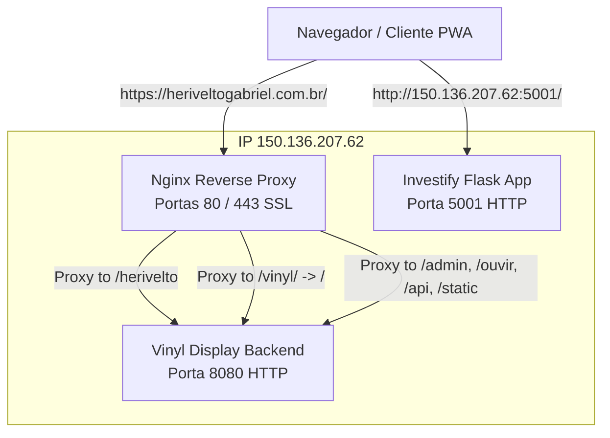

# Configuração e Arquitetura do Servidor de Produção

Este documento detalha o funcionamento, portas, processos e a infraestrutura de rede configurados no servidor remoto **`150.136.207.62`** (Oracle Linux 8 / RHEL 8).

---

## 1. Visão Geral da Arquitetura

O servidor roda duas aplicações Python e utiliza o **Nginx** como ponto de entrada único para o domínio seguro (`https://heriveltogabriel.com.br`).



---

## 2. Processos e Portas do Sistema

Existem três serviços principais rodando no sistema:

| Serviço | Porta | Tipo de Acesso | Diretório de Instalação | Usuário | Comando de Execução |
| :--- | :--- | :--- | :--- | :--- | :--- |
| **Nginx** | `80` (HTTP) / `443` (HTTPS) | Público (Seguro) | `/etc/nginx/` | `root` / `nginx` | `/usr/sbin/nginx` |
| **Vinyl Display PWA** | `8080` (HTTP) | Interno (Local) | `/home/opc/vinyl_display/` | `opc` | `/usr/bin/python3.9 -m vinyl_display.server` |
| **Investify App** | `5001` (HTTP) | Público (Direto) | `/opt/investify-app/` | `opc` | `/opt/investify-app/venv/bin/python /opt/investify-app/server.py` |

---

## 3. Serviços systemd (Gerenciamento)

Todos os processos são gerenciados de forma resiliente pelo `systemd`.

### 3.1. Vinyl Display (`vinyl-display.service`)
- **Arquivo de Configuração:** `/etc/systemd/system/vinyl-display.service`
- **Conteúdo da Unit:**
  ```ini
  [Unit]
  Description=Vinyl Display PWA Server
  After=network.target

  [Service]
  Type=simple
  User=opc
  WorkingDirectory=/home/opc/vinyl_display
  ExecStart=/usr/bin/python3.9 -m vinyl_display.server
  Restart=always
  RestartSec=5

  [Install]
  WantedBy=multi-user.target
  ```
- **Comandos Úteis:**
  ```bash
  sudo systemctl status vinyl-display   # Ver status
  sudo systemctl restart vinyl-display  # Reiniciar
  sudo journalctl -u vinyl-display -f   # Ver logs em tempo real
  ```

### 3.2. Investify (`investify.service`)
- **Arquivo de Configuração:** `/etc/systemd/system/investify.service`
- **Conteúdo da Unit:**
  ```ini
  [Unit]
  Description=Investify Flask Application
  After=network.target

  [Service]
  User=opc
  WorkingDirectory=/opt/investify-app
  ExecStart=/opt/investify-app/venv/bin/python /opt/investify-app/server.py
  Restart=always

  [Install]
  WantedBy=multi-user.target
  ```
- **Comandos Úteis:**
  ```bash
  sudo systemctl status investify   # Ver status
  sudo systemctl restart investify  # Reiniciar
  sudo journalctl -u investify -f   # Ver logs em tempo real
  ```

### 3.3. Nginx (`nginx.service`)
- **Arquivo de Configuração:** `/usr/lib/systemd/system/nginx.service`
- **Comandos Úteis:**
  ```bash
  sudo systemctl status nginx
  sudo systemctl restart nginx
  sudo nginx -t  # Testa a sintaxe dos arquivos de configuração
  ```

---

## 4. Configurações de Rede e Segurança

### 4.1. Nginx Proxy Reverso e SSL (`/etc/nginx/conf.d/herivelto.conf`)
O Nginx está configurado para direcionar os subcaminhos de maneira inteligente para o backend na porta `8080`. O Certbot adicionou automaticamente os certificados SSL e o redirecionamento de HTTP para HTTPS:

```nginx
server {
    server_name heriveltogabriel.com.br www.heriveltogabriel.com.br;

    # Rota raiz (/) exibe de forma transparente o perfil (/herivelto)
    location = / {
        proxy_pass http://127.0.0.1:8080/herivelto;
        proxy_set_header Host $host;
        proxy_set_header X-Real-IP $remote_addr;
        proxy_set_header X-Forwarded-For $proxy_add_x_forwarded_for;
        proxy_set_header X-Forwarded-Proto $scheme;
    }

    # Rota do app principal Display Vinyl (/vinyl/)
    location /vinyl/ {
        proxy_pass http://127.0.0.1:8080/;
        proxy_set_header Host $host;
        proxy_set_header X-Real-IP $remote_addr;
        proxy_set_header X-Forwarded-For $proxy_add_x_forwarded_for;
        proxy_set_header X-Forwarded-Proto $scheme;
    }

    # Redirecionamento amigável de /vinyl para /vinyl/
    location = /vinyl {
        return 301 $scheme://$host/vinyl/;
    }

    # Encaminha as demais rotas (/admin, /ouvir, /static, /api, etc.)
    location / {
        proxy_pass http://127.0.0.1:8080;
        proxy_set_header Host $host;
        proxy_set_header X-Real-IP $remote_addr;
        proxy_set_header X-Forwarded-For $proxy_add_x_forwarded_for;
        proxy_set_header X-Forwarded-Proto $scheme;
    }

    listen 443 ssl; # Managed by Certbot
    ssl_certificate /etc/letsencrypt/live/heriveltogabriel.com.br/fullchain.pem; # Managed by Certbot
    ssl_certificate_key /etc/letsencrypt/live/heriveltogabriel.com.br/privkey.pem; # Managed by Certbot
    include /etc/letsencrypt/options-ssl-nginx.conf; # Managed by Certbot
    ssl_dhparam /etc/letsencrypt/ssl-dhparams.pem; # Managed by Certbot
}

server {
    if ($host = www.heriveltogabriel.com.br) {
        return 301 https://$host$request_uri;
    } # Managed by Certbot

    if ($host = heriveltogabriel.com.br) {
        return 301 https://$host$request_uri;
    } # Managed by Certbot

    listen 80;
    server_name heriveltogabriel.com.br www.heriveltogabriel.com.br;
    return 404; # Managed by Certbot
}
```

### 4.2. Certificados Let's Encrypt (HTTPS)
Os certificados de criptografia válidos estão armazenados em:
- **Caminho:** `/etc/letsencrypt/live/heriveltogabriel.com.br/`
- **Renovação:** Uma tarefa agendada (systemd timer / cron job) foi configurada automaticamente pelo Certbot para renovar os certificados de 3 em 3 meses.

### 4.3. Firewall do Linux (`firewalld`)
As regras ativas do firewall de borda da máquina permitem tráfego nos seguintes serviços e portas:
- **Serviços Ativos:** `http` (porta 80), `https` (porta 443), `ssh` (porta 22)
- **Portas Específicas:** `5001/tcp` (Investify), `8080/tcp` (Acesso direto alternativo ao backend)

*Comando para listar regras do firewall:*
```bash
sudo firewall-cmd --list-all
```

### 4.4. Regras do SELinux
Como estamos em um sistema Oracle Linux, o **SELinux** está ativo. Por padrão, o SELinux proibiria o Nginx de se comunicar com portas locais tcp como a `8080`. Para resolver isso, configuramos a política persistente:
```bash
sudo setsebool -P httpd_can_network_connect 1
```

---

## 5. Fluxo de Implantação (Deployment)

Para atualizar o código do **Vinyl Display**, utilizamos o script local `deploy.sh`. Ele executa o seguinte fluxo:
1. Compacta localmente o código do projeto ignorando pastas de desenvolvimento, cache, repositórios locais, a base de dados local (`collection.db`) e o arquivo de ambiente local (`.env`), garantindo a preservação do banco de dados e das configurações de produção do servidor remoto.
2. Transmite via SSH para o diretório `/home/opc/vinyl_display` no servidor de produção.
3. Remove arquivos ocultos de metadados do macOS (`._*`).
4. Reinicia o serviço `vinyl-display` no systemd (`sudo systemctl restart vinyl-display`).
5. A nova versão do backend é recarregada dinamicamente, enquanto o Nginx continua servindo sem qualquer tempo de inatividade.
